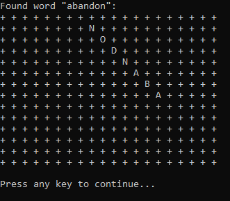

# word-search-solver
A "Word Search" solver

## Instructions:
The program requires two plaintext files, **words.txt** and **puzzle.txt**, in the same directory as the executable.
Input the word list into **words.txt**, with each word on its own line.
Input the puzzle into **puzzle.txt**, with no spaces between the characters.
Run the program, and follow the on-screen instructions.
The program will find the words, and display them one by one at their position in the puzzle.